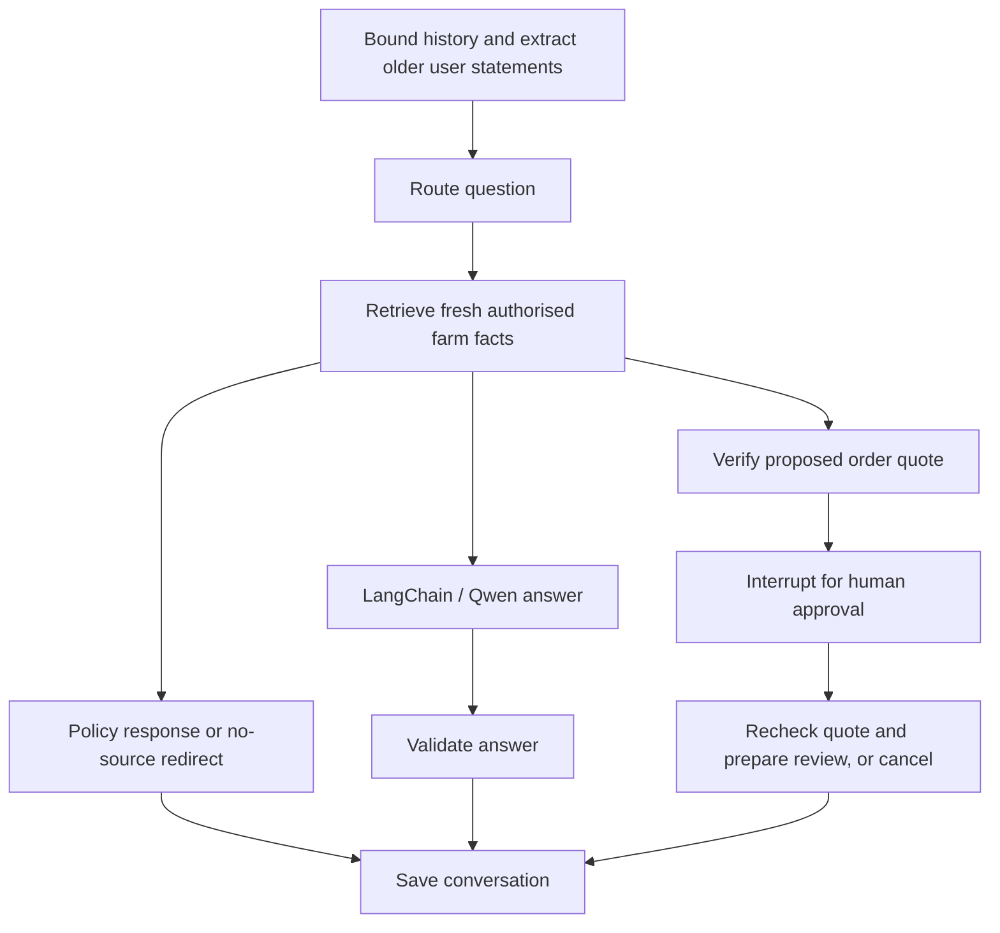

# Wednesday to Friday: implemented AI workflow

## Wednesday: agent foundations and production controls

The Qwen model runs through LangChain `create_agent`. Custom `before_model` middleware bounds
message history; `wrap_model_call` adds scope-specific finance, buying or agronomy instructions.
The graph chooses the route and adjusts output budgets rather than relying on native tool calling
unsupported by the small configured Qwen model. Current verified data takes priority over history.

Conversation operations authenticate the current JWT through Spring on every request. The browser
cannot submit a farmer ID to select someone else's memory. JWTs are transient runtime context,
not graph state or checkpoint config. Validation, a 20-turn/minute per-farmer limit, a 50-conversation
per-farmer cap and a two-generation concurrency limit bound resource use.

An explicit LangGraph interrupt pauses a proposed group-order review. The farmer can approve or
cancel. A resumed approval rechecks the authenticated opportunity, capacity and current commercial
figures. A changed/unavailable quote never produces a ready action. Approval returns a review link
and quantity only; it does not join an order, transfer money or mutate the ledger. Joining still
requires the normal group-order confirmation. Replayed/foreign approval requests are rejected.

## Thursday: state, routing and memory

`langchain-service/app/workflow.py` contains the explicit graph:



The state schema stores messages, summary, route, source passages, fresh ledger context and
approval status. A message reducer handles append/replacement. History is bounded to roughly
12 messages and 12,000 characters before generation. Older user statements are summarised
extractively into at most 2,000 characters; generated advice is not promoted into verified facts.
Short follow-up retrieval uses recent user questions. Safety policy is evaluated against the
current question, not against older context.

SQLite checkpoints and ownership metadata persist on the `ai_conversations` Docker volume,
including unfinished approvals. Users can delete the current conversation from the UI.
Each thread retains at most 64 recent recovery snapshots rather than unlimited checkpoint history.
Idle threads expire after 30 days on access; starting a conversation purges expired threads.
Data remains private but is not encrypted at rest: restrict volume access and protect backups.
This is a lightweight single-worker deployment, not a multi-replica/HA implementation.
For larger deployments, use a PostgreSQL checkpointer and distributed locking/rate limits.
Do not run multiple Uvicorn workers against this SQLite configuration.

## Friday: tracing and evaluation

Automatic LangChain tracing is deliberately disabled. Opt-in SDK spans report root graph runs,
node execution and an LLM span with timestamps, hierarchy and generic failure status.
An irreversible hash of the random conversation UUID correlates runs into anonymous LangSmith
conversation threads; the real conversation UUID and farmer identity are not exported.
Allowlisted spans contain no prompts, responses, farmer IDs, JWTs, ledger figures or checkpoint
config. Tracing failures must not break the assistant.

Configure privately in the deployment environment, not source control:

```dotenv
AI_LANGSMITH_TRACING=true
LANGSMITH_API_KEY=<private key>
LANGSMITH_PROJECT=agritech-graph
```

No key is currently configured in this workspace. Actual LangSmith delivery cannot be verified
until a key is supplied and the service restarted. The wiring is covered by mocked SDK tests.
Use LangSmith's project view to inspect the graph/node/LLM hierarchy; raw conversations
are intentionally absent.

The existing synthetic 12-question evaluation now calls the conversation graph, with an isolated
thread per case and cleanup afterwards. Local reports contain checks, not private model answers.
An explicit LangSmith run creates a synthetic dataset and publishes boolean evaluator results:

```bash
cd langchain-service
export AI_EVAL_TOKEN='<synthetic account JWT>'
python evaluation/evaluate.py --url http://127.0.0.1:18080
python evaluation/evaluate.py --url http://127.0.0.1:18080 --langsmith
```

The second command requires `LANGSMITH_API_KEY` and installed requirements. Only synthetic
case data and boolean checks are exported; answers and ledger context stay local. Checks cover
relevance keywords, retrieved-source coverage and known unsupported claims, not comprehensive
semantic correctness. Human review remains necessary.

## Run and API

```bash
docker compose -f docker-compose.yml -f docker-compose.ai.yml up -d --build
```

For IDE deployment, set `AI_BACKEND_URL` to Spring's reachable internal address, and
`AI_CHECKPOINT_DB` to a persistent private file path. Do not expose Python directly to the
internet. Browser traffic goes through the authenticated Spring gateway:

- `POST /api/ai/conversations`: create an owned thread.
- `GET /api/ai/conversations/{id}`: restore history and a pending approval.
- `DELETE /api/ai/conversations/{id}`: delete history/checkpoints.
- `POST /api/ai/conversations/{id}/turn`: `{"prompt":"What about germination?"}`.
- The same turn endpoint can accept an explicit review proposal:
  `{"action":{"orderId":"<uuid>","quantity":3}}`.
- `POST /api/ai/conversations/{id}/resume`:
  `{"interruptId":"<pending-id>","approved":true}`.

Existing `POST /api/ai/chat` and internal `/api/generate` stay compatible and stateless.
The new frontend uses conversation endpoints. The original project, its database and AI
containers are unchanged. No courses or presentation materials were completed on your behalf.
